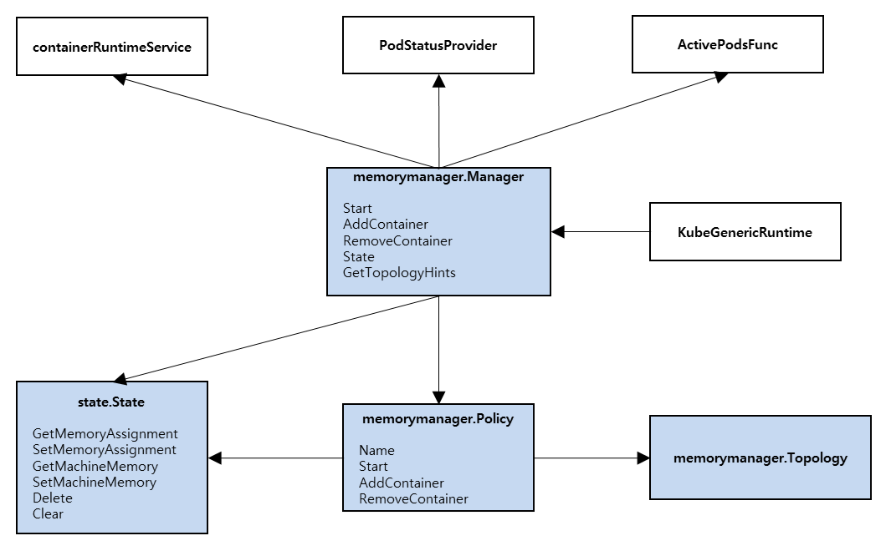
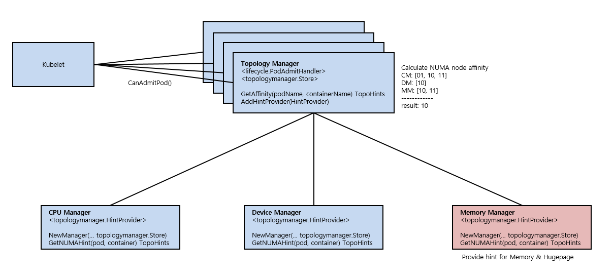

# Memory Manager

_Authors:_

- @bg-chun - Byonggon Chun &lt;bg.chun@samsung.com&gt;
- @ohsewon - Sewon Oh &lt;sewon.oh@samsung.com&gt;
- @admanV - Hyunsung Cho &lt;hs2.cho@samsung.com &gt;

## Table of Contents

- [Overview](#overview)
- [Motivation](#motivation)
  - [Related Features](#Related-features)
  - [Related issues](#Related-issues)
  - [Goals](#goals)
  - [Non-Goals](#non-goals)
  - [User Stories](#user-stories)
    - [Story 1](#story-1)
    - [Story 2](#story-2)
- [Proposal](#proposal)
  - [Proposed Changes](#proposed-changes)
    - [New Component: Memory Manager](#new-component-memory-manager)
      - [New Interfaces](#new-interfaces)
    - [Topology Manager changes](#topology-manager-changes)
    - [Internal Container Lifecycle changes](#internal-container-lifecycle-changes)
    - [Feature Gate and Kubelet Flags](#feature-gate-and-kubelet-flags)
- [Graduation Criteria](#graduation-criteria)
  - [Phase 1: Alpha (target v1.1x)](#phase-1-Alpha-target-v11x)
  - [Phase 2: Beta](#phase-1-Beta)
  - [GA (stable)](#ga-stable)
- [Limitations and Challenges](#Limitations-and-Challenges)
- [Appendix A](#Appendix-A)

# Overview

NUMA Awareness is well known for a solution to boost performance for diverse use cases including DPDK and Database. Kubernetes support NUMA related features for NUMA sensitive containers.
The features(CPU Manager, Device Manager, Topology Manager) treat CPU, Device and it's NUMA topology, but there's no feature for memory and hugepages. It can cause inter-NUMA node communication for Memory access which leads to increase an I/O latency and decrease performance.

The Memory Manager is proposed for a solution deploying Pod and Containers with Guaranteed QoS class of Memory and Hugepages under NUMA awareness.

# Motivation

## Related Features

- [Node Topology Manager][node-topology-manager] is a feature that collects topology hint from various hint providers to calculate socket affinity for a container. Topology Manager judge container whether admit or not under configured policy and socket affinity.

- [CPU Manager][cpu-manager] is a feature provides a solution for CPU Pinning based on cgroups cpuset subsystem, it also offer topology hint to Topology Manager.

- [Device Manager][device-manager] is a one of features provides topology hint for Topology Manager. The main objectivity of Device Manager is allow vendors to adverise their resources to kubelet.

- [Hugepages][hugepages] is a feature allows container to consume pre-allocated hugepages with pod isolation of huge pages.

- [Node Allocatable Feature][node-allocatable-feature] is a feature helps to reserve compute resources to prevent resource starvation. The kube-reserved and system-reserved is used to reserve resources for kubelet and system(OS, etc). Now following resources are supported to reserve: cpu, memory, ephemral storage.

## Related issues

- [Hardware topology awareness at node level (including NUMA)][numa-issue]
- [Support Container Isolation of Hugepages][hugepage-issue]

## Goals

- Guarantee alignment of resources for isolating container's Memory and Hugepages with CPU and I/O devices.

- Provide topology hint for Memory and Hugepages for Topology manager.

## Non-Goals
- Updating scheduler, pod spec is out of scope at this point.

- This proposal only focus on Linux based system.

## User Stories

### Story 1 : Networking Acceleration using DPDK

- DPDK(Data Plane Development Kit) is set of libraries to accelerate packet processing on userspace. DPDK requires dedicated resources and alignment of resources under NUMA awareness. There should be a way to gurantee reserve Memory and Hugepages with other computing resources on desinated Socket for containerized VNF using DPDK.

### Story 2 : Database

- Databases(Oracle, PostgreSQL, MySQL, MongoDB, SAP) consumes massive Memory and Hugepages, in order to reduce memory access latency and improve performance dramatically resources(CPU, Memory, Hugepages, I/O Devices) should be aligned.

# Proposal

## Proposed Changes

### New Component: Memory Manager

A new component of Kubelet enables NUMA-awareness for memory and hugepages. The main roles of this component are listed below.

#### 1) Calculate NUMA node affinity for memory and hugepages when Pod admission is requested.
NUMA node affinity represents that which NUMA node has enough capacity of resources for container. To calculate affinity Memory Manager takes capacity of memory and pre-allocated hugepages per NUMA node except system reserved capacity by Node Allocatable feature. Then when pod is admitted, Memory Manager checks resources availablity of each NUMA nodes and reserves resources internally. 

- Node affinity of memory can be calcuated by below formula.

- Node affinity of hugepage can be calculated by below xxx.


#### 2) Provide topology hint(node affinity) for Topology Manager.
aaa

#### 3) Isolate memory and hugepages.
Restrict memory access of contaer to a spesific NUMA node.
Cgroups cpuset subsystem is used to isolate memory and hugepages.


Consequently, Memory Manager guarantees that container's memory and hugepages are isolated to a single NUMA node.
 
#### New Interfaces

```go
package memory manager

type State interface {
  GetAllocatableMemory() uint64
  GetMemoryAssignments(containerID string) (MemorySet, bool)
  GetDefaultMemoryAssignments() ContainerMemoryAssignments
  GetMemoryPool() MemorySet
  SetAllocatableMemory(allocatableMemory uint64)
  SetMemoryAssignments(containerID string, ms MemorySet)
  SetDefaultMemoryAssignments(as ContainerMemoryAssignments)
  SetMemoryPool(memorySet MemorySet)
  Delete(containerID string)
  ClearState()
}

type Manager interface {
  Start(ActivePodsFunc, status.PodStatusProvider, runtimeService)
  AddContainer(p *v1.Pod, c *v1.Container, containerID string) error
  RemoveContainer(containerID string) error
  State() state.Reader
  GetTopologyHints(pod v1.Pod, container v1.Container) []topologymanager.TopologyHint
}

type Policy interface {
  Name() string
  Start(s state.State)
  AddContainer(s state.State, pod *v1.Pod, container *v1.Container, containerID string) error
  RemoveContainer(s state.State, containerID string) error
}
```

_Listing: Memory Manager and related interfaces (sketch)._



_Figure: Memory Manager components._



### Topology Manager changes

Topology Manager takes hints from cpu manager, device manager. After that, calculate best affinity with policy and used to determine if the pod can admit. Likewise, Memory Manager provide hints to Topology Manager.

Memory Manager implement 'Manager' interface. So Topology Manager add Memory Manager as hint provider at initializing container manager.

```go
package cm

func NewContainerManager(...) (ContainerManager, error) {
  ...
  cm.topologyManager.AddHintProvider(cm.memoryManager)
  ...
}
```

Provided hint from Memory Manager is affinity of NUMA nodes(bits) like other managers. So there will be few or no changes to the topology manager.

_Figure: Interfaces with topology manager_


### Internal Container Lifecycle changes

InternalContainerLifecycle interface has 3 functions, PreStartContainer, PreStopContainer, PostStopContainer. In this cases, Memory Manager has to involve managing memory/hugepages when start/stop container.

Memory Manager manage memory with pod, container ID so these function needs that too.

```go
package cm

func (i *internalContainerLifecycleImpl) PreStartContainer(...) {
  ...
  err := i.memoryManager.AddContainer(pod, containerID)
  ...
}

func (i *internalContainerLifecycleImpl) PreStopContainer(...) {
  ...
  err := i.memoryManager.RemoveContainer(pod, containerID)
  ...
}

func (i *internalContainerLifecycleImpl) PostStopContainer(...) {
  ...
  err := i.memoryManager.RemoveContainer(pod, containerID)
  ...
}
```
### Feature Gate and Kubelet Flags

A new feature gate will be added to enable the Memory Manager feature. This feature gate will be enabled in Kubelet, and will be disabled by default in the Alpha release.

- Proposed Feature Gate:  
  `--feature-gate=MemoryManager=true`

This will be also followed by a Kubelet Flag for the Memory Manager Policy, which is described above. The `none` policy will be the default policy.

- Proposed Policy Flag:  
  `--memory-manager-policy=none|SingleNUMA`

# Graduation Criteria

## Phase 1: Alpha (target v1.1x)
- Feature gate is disabled by default.
- Alpha Implimentation of Memory Manager based on SingleNUMA policy of Topology Manager

## Phase 2: Beta

- TBD

## GA (stable)

- TBD

## Limitations and Challenges

- Alpha에선 Topology Manager의 haftStrict Policy만 따른다

- 완벽한 메모리 관리는 어려움. (os/kubelet reserved만큼 여유를 두면 상관없지만 이는 손해임) => offset 두는 쪽으로

- NUMA 노드 별 메모리 관리에 대한 보장 => offset 두어서 안전하게 관리한다는걸 어필해보자

[node-topology-manager]: https://github.com/kubernetes/enhancements/blob/dcc8c7241513373b606198ab0405634af643c500/keps/sig-node/0035-20190130-topology-manager.md
[cpu-manager]: https://github.com/kubernetes/community/blob/master/contributors/design-proposals/node/cpu-manager.md
[device-manager]: https://github.com/kubernetes/community/blob/master/contributors/design-proposals/resource-management/device-plugin.md
[hugepages]: https://github.com/kubernetes/enhancements/blob/master/keps/sig-node/20190129-hugepages.md
[node-allocatable-feature]: https://github.com/kubernetes/community/blob/master/contributors/design-proposals/node/node-allocatable.md
[numa-issue]: https://github.com/kubernetes/kubernetes/issues/49964
[hugepage-issue]: https://github.com/kubernetes/kubernetes/issues/80716
